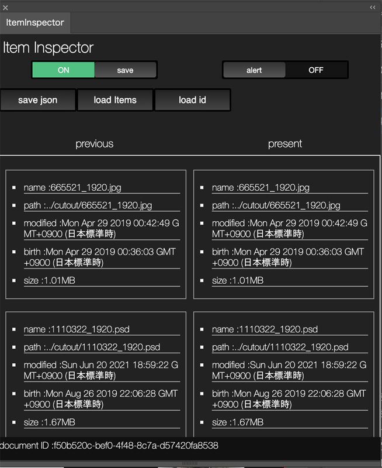

<h1>Illustrator Extension ItemInspector</h1>

    the Extension watches linked image files on Illustrator.
    when Illustrator saves ai file , the Extension saves image data as a JSON.
    next time , the Extension loads previous data from JSON automatically and
    compare it with present linked images. it will alert if it found difference between previous and present.

    open the Extension first.
    it could switch alert and save event. just click check button.
    pussing save button , it saves linked image data as a JSON in directory which located at same with ai file.
    next time , the Extension loads json automatically.
    if you turn on save switch , it saves JSON automatically when you save ai data as well.
    previous items is linked images data last time you edited. present items is linked images data now placed on Illustrator.
    if the Extension detects difference between previous and present , it labels yellow on the list and if you turn on the alert button , the Extension alerts it as well.

<h2>which detail compare?</h2>
<ul>
<li>file name</li>
<li>relative path(from ai file)</li>
<li>modified date(it could be changed when copy and past)</li>
<li>birth date, the date is file was created</li>
<li>file size</li>
</ul>

Japanese explanation <a href="https://kawano-shuji.com/justdiary/2021/06/21/%e9%85%8d%e7%bd%ae%e7%94%bb%e5%83%8f%e3%81%ae%e5%b7%ae%e7%95%b0%e3%82%92%e6%a4%9c%e7%9f%a5%e3%81%99%e3%82%8b-illustrator-extension%e3%81%ae%e3%83%97%e3%83%ad%e3%83%88%e3%82%bf%e3%82%a4%e3%83%97-itemin/">here</a>

30 july 2021 　update(ver 0.8.3)

detects more detail info from files
